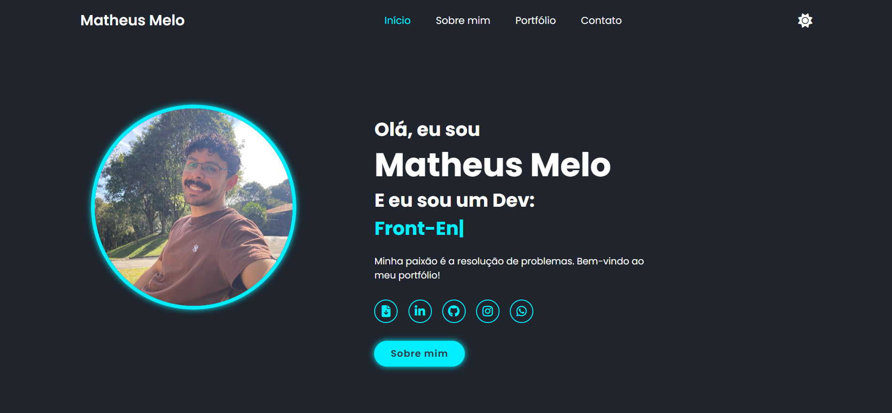

# 👋 Olá, eu sou o Matheus Melo! 

Este aqui é o meu portfólio profissional, um projeto que desenvolvi com muito entusiasmo para o desafio **WASE STAR** da **WASE**. Mais do que apenas um site, esta página é um reflexo da minha jornada atual: a transição da Infraestrutura de TI para o Desenvolvimento Fullstack.

👉 **[Dê uma olhada no projeto ao vivo!](https://matfels.github.io/Portfolio-Wase/)**

---

## 🎯 O Objetivo
Criei esta página para centralizar minha trajetória, meus estudos e o que venho construindo. Ela foi pensada para ser limpa, rápida e, acima de tudo, útil para quem deseja conhecer meu trabalho técnico e meu perfil acadêmico.

## 🛠️ O que usei para construir?
Decidi manter a base sólida e focar no domínio do front-end essencial:
- **HTML5 & CSS3**: Para garantir que tudo esteja no lugar certo e com uma aparência moderna (usei muitas variáveis CSS para facilitar o Dark Mode!).
- **JavaScript**: Ele é o responsável pela escrita dinâmica e pela troca de temas.
- **Formspree**: Uma solução prática que encontrei para tornar o formulário funcional sem complicar o back-end desnecessariamente.

## ✨ Os meus "toques especiais" (Diferenciais)
Nesse projeto, eu não queria apenas entregar o básico. Eu quis colocar a experiência de quem usa o site em primeiro lugar:
- **Navegação de "App" no celular**: Percebi que menus no topo são ruins para usar com uma mão só. Então, criei uma **Tab Bar inferior** automática para quando você acessa pelo celular.
- **Respeito ao seu sistema**: Se o seu computador já estiver no Modo Escuro, o meu site vai te receber assim automaticamente.
- **Animações pensadas**: O efeito de digitação não é só estético; ele serve para mostrar rapidamente minha versatilidade como Dev em formação.

## 🚀 Como testar na sua máquina
Se quiser ver o código de perto, é só seguir esses passos:
1. Clone o repositório:
   ```bash
   git clone [https://github.com/matfels/Portfolio-Wase.git](https://github.com/matfels/Portfolio-Wase.git)

    ```
   